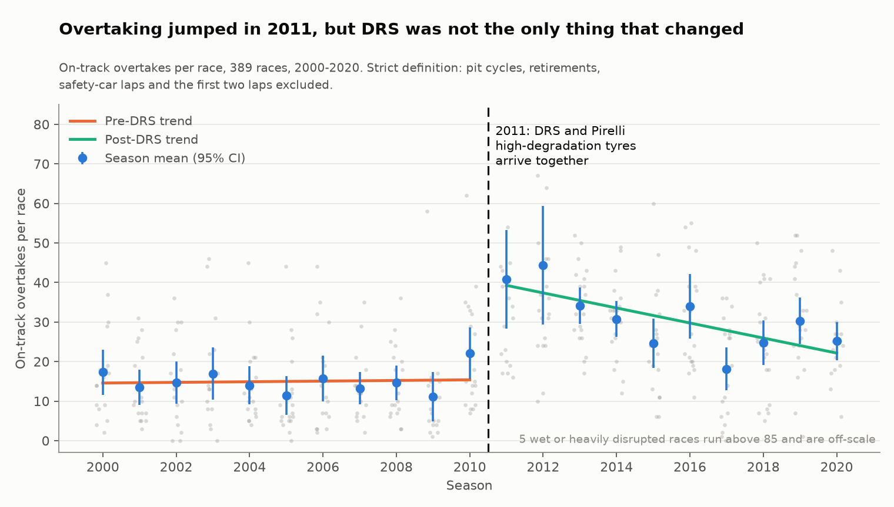
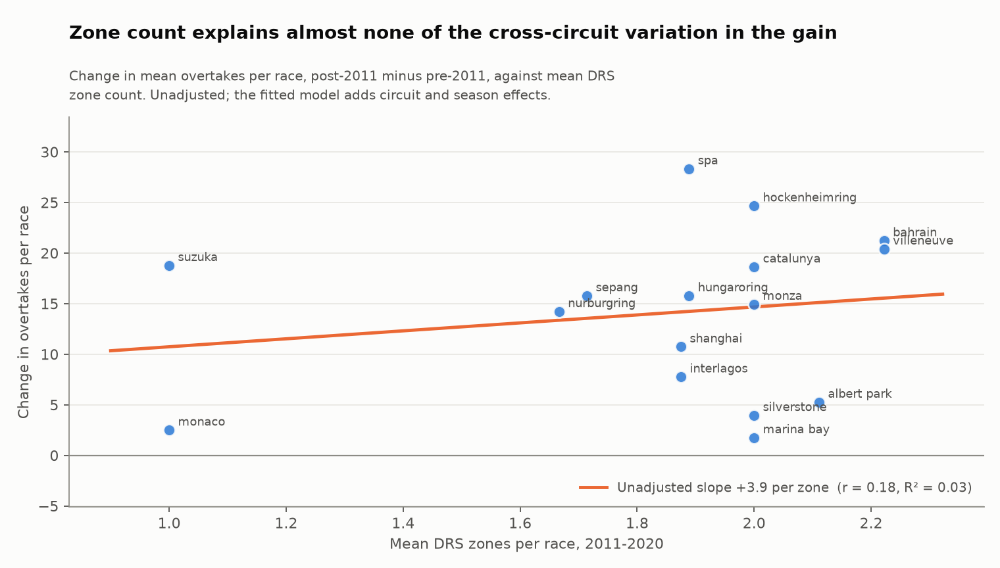
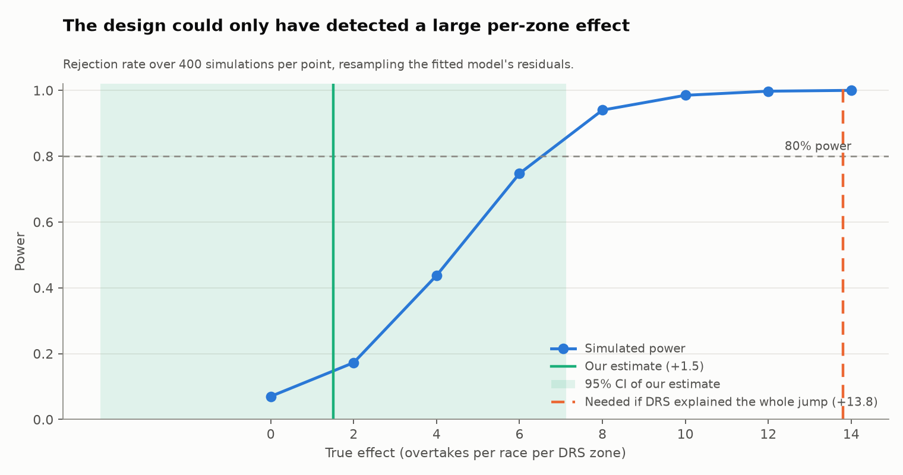

# Did DRS Increase Overtaking?

A causal analysis of Formula 1's 2011 Drag Reduction System (DRS) rule change, using
389 races and 427,288 lap records from 2000 to 2020.

Full write-up: [PAPER.md](PAPER.md)

## Result

Overtaking jumped from 15.0 to 30.7 passes per race in 2011, the year DRS arrived. It is
usually credited to DRS, but Pirelli's high-degradation tyres arrived the same season,
so a season-level comparison cannot tell the two apart.

Once the tyre change is controlled for, the effect of one extra DRS zone is **+1.5
overtakes per race (95% CI -4.1 to +7.1, p = 0.60)**. That is indistinguishable from
zero, and the sign flips to -0.4 when five wet or chaotic races are dropped.

The design can only detect effects of about 8 overtakes per zone (80% power), so this
does not show DRS did nothing. What it does show: for DRS alone to explain the 2011
jump it would need about **+13.8 per zone**, which is above the upper end of the
interval. **DRS as the only cause is ruled out at the 5% level**, and the tyre change
has to account for most of the increase.



## Approach

**Separating DRS from the tyres.** The tyre change hit every circuit equally. DRS did
not: circuits ran between one and three zones, and the count changed over time at 17 of
the 30 circuits in the post-2011 panel. So the model uses both circuit and year fixed
effects:

```
overtakes[i,t] ~ post2011[t] x n_drs_zones[i,t] + n_laps + C(circuit[i]) + C(year[t])
```

The year effects absorb anything that changed for every circuit in a season (the
tyres), and the circuit effects absorb each track's baseline. The DRS coefficient is
estimated from differences in zone count between circuits in the same season. A naive
interrupted time series, which attributes the whole +26.0 jump to 2011, is fitted
alongside for comparison.

**Counting overtakes.** F1 publishes no overtake count, so an overtake is defined as two
drivers swapping order between consecutive laps, with pit cycles, safety-car restarts,
the first two laps and lapped traffic removed. Of 60,468 raw position swaps, 8,919 are
kept under the strict definition and 12,565 under the loose one.

**Detecting pit stops.** Ergast's pit-stop table starts in 2011, the treatment year, so
using it would remove pit-cycle swaps only after the treatment and bias the result.
Instead a pit lap is any lap more than 11 s slower than the field median on that lap.
Checked against the 8,031 recorded stops from 2011 to 2020, it gets 86.3% recall and
87.4% precision.

**DRS zone counts.** No public dataset exists, so [`data/drs_zones.csv`](data/drs_zones.csv)
is hand-coded: 377 circuit-seasons, each with a source URL. 306 rows are documented
directly, 71 are carried over from identical seasons on either side and flagged as
`interpolated`.

## Robustness

| Specification | Outcome | Per zone | 95% CI | p | n |
| --- | --- | --- | --- | --- | --- |
| Two-way FE, HAC errors | strict | +1.51 | -4.11 to +7.13 | 0.60 | 377 |
| Two-way FE, circuit-clustered | strict | +1.51 | -5.34 to +8.36 | 0.67 | 377 |
| Two-way FE, HAC errors | loose | +1.66 | -5.88 to +9.20 | 0.67 | 377 |
| Documented zone rows only | strict | +1.27 | -5.59 to +8.13 | 0.72 | 306 |
| Excluding 5 extreme races | strict | -0.40 | -4.57 to +3.78 | 0.85 | 374 |
| Poisson GLM (log link) | strict | -0.4% | -21% to +26% | 0.98 | 377 |

Every OLS fit uses Newey-West errors (`maxlags=3`), since overtaking counts are serially
correlated within a season. Circuit-level dose-response is weak as well: the unadjusted
slope is +3.9 overtakes per zone with R² = 0.03.



**Power.** Closed-form MDE is 8.03 per zone (strict). Simulating from the fitted model's
residuals, 400 refits per effect size, puts the 80% power threshold between 6 and 8.



**Placebos.** Fake break dates in 2007, 2008 and 2009 (fitted on 2000-2010 only) produce
no significant level shift, but they all produce a significant slope change, so only
the level shift from the time series is used. The 2011 break also "predicts" more
finishers per race (+1.7, p = 0.001), which DRS cannot cause. Both point to 2011
differing from 2010 in more ways than DRS.

## Limitations

- **Zone placement is not random.** The FIA added zones where passing was hardest,
  which likely biases the estimate downward. Fixed effects do not fully fix this.
- **The fixed effects absorb 76% of the variation in zone count**, since most circuits
  kept the same number of zones. That is why the interval is wide.
- **Safety cars are inferred** from slow field-wide lap times; there is no safety-car
  field in the data, and short virtual safety cars are missed.
- **No weather data.** The five highest-count races are all wet or chaotic, and
  dropping them flips the sign.
- **Zone count, not zone length**, is the treatment measure. Lengths are only in
  per-race FIA documents.

## Data

| Source | Used for |
| --- | --- |
| [Ergast CSV dump](https://github.com/rubenv/ergast-mrd) (mirror, March 2022 snapshot) | lap positions and times, results, pit stops |
| [Jolpica-F1 API](https://api.jolpi.ca/) | cross-check of the mirror |
| `data/drs_zones.csv` | DRS zone counts per circuit and season |

ergast.com has been retired, so the analysis runs on a mirror of its last CSV dump. As
a check, 37 races were re-fetched from Jolpica-F1 and compared: all 38,014 matching lap
records agree on position.

## Running it

```bash
python -m venv .venv && source .venv/bin/activate
pip install -r requirements.txt
python src/ingest.py && python src/build_drs_zones.py
python src/overtakes.py && python src/panel.py
python src/its.py && python src/power.py && python src/charts.py

# optional cross-check against Jolpica-F1 (network, rate limited)
python src/ingest_laps.py --start 2000 --end 2002 && python src/validate_sources.py
```

```
src/ingest.py            download and load the Ergast dump, filter to 2000-2020
src/build_drs_zones.py   build the hand-coded zone table with a source per row
src/overtakes.py         overtake definition, exclusions, pit detector and its check
src/panel.py             join race outcomes to zone counts
src/its.py               naive time series, fixed-effects panel, placebos, robustness
src/power.py             closed-form and simulated minimum detectable effect
src/charts.py            figures
src/ingest_laps.py       cached Jolpica-F1 downloader for the cross-check
src/validate_sources.py  compare the mirror to Jolpica-F1
notebooks/               scratch exploration
```

`data/drs_zones.csv` is the only data file in the repo; everything else is regenerated.
